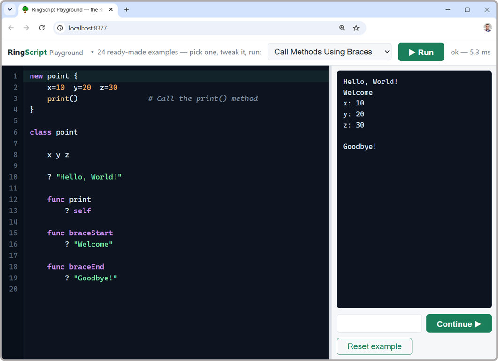

<p align="center">
  
</p>

<h1 align="center">The Ring language, resident in your browser</h1>

<p align="center">
  <strong><a href="https://mayouni.github.io/ringscript/">mayouni.github.io/ringscript</a></strong> ·
  <a href="https://mayouni.github.io/ringscript/start.html">Start here</a> ·
  <a href="https://mayouni.github.io/ringscript/playground/">Playground</a> ·
  <a href="https://mayouni.github.io/ringscript/tutorial-clock.html">Tutorial</a> ·
  <a href="https://mayouni.github.io/ringscript/story.html">The story</a>
</p>

<p align="center">
  <strong>version 0.9</strong> · Ring 1.27 · MIT · a Softanza Project
</p>

RingScript compiles the [Ring](https://ring-lang.github.io/) VM to
WebAssembly and wraps it in a small resident bridge: persistent state
across evaluations, trapped errors with real line numbers, interactive
input, embedded pure-Ring libraries, and a two-way JSON bridge to
JavaScript. Zig-first — no Emscripten, no npm, no build steps beyond one
command.

<p align="center">
  
  <br>
  <em>The Playground: pick an example, edit it, run it. The Ring VM is resident in
  the page; programs that ask for input pause and wait for your answer.</em>
</p>

## Start here — a folder that already runs

If you have never built a web page, this is the shortest path. The **starter
kit** is one zip with a working page, the runtime and a small web server —
nothing to install, and Ring itself is not required.

**[Download the starter kit](https://mayouni.github.io/ringscript/ringscript-starter.zip)**
· 240 KB · Windows, macOS, Linux

1. Unzip it anywhere.
2. Double-click `start-windows.bat`, or `start-mac-linux.sh`.
3. A small console window opens — that is the server — and your browser lands
   on a working page.
4. Edit `app.ring`, save, press Refresh. No build step, no compiler, no tools.

Two examples are included:

| | |
|---|---|
| `index.html` + `app.ring` | a greeting and a sum — start here |
| `clock.html` + `clock.ring` | a working analog clock, hands and all |

The clock is built line by line in
**[the tutorial](https://mayouni.github.io/ringscript/tutorial-clock.html)**,
assuming no web experience. Full walkthrough with screenshots:
**[Start here](https://mayouni.github.io/ringscript/start.html)**.

> **What it is not.** RingScript runs Ring *inside a web page*. It is not a way
> to run Ring programs you already have: a desktop program using RingQt or
> GUILib reaches Qt by loading a native library, and RingScript carries no Qt at
> all. There *is* a road for those — Mahmoud Fayed's *Try Ring Online*, which is
> RingQt compiled for WebAssembly — and the
> [Q&A](https://mayouni.github.io/ringscript/faq.html) compares the two: 22.7 MB
> against RingScript's 0.35 MB, because a web page is not a desktop application.

## Status — 0.9, and why not 1.0 yet

RingScript is **0.9**: complete in function and verified against Ring's
own corpus (see [Verification](#verification)), already carrying real
work — it has been used in four of my projects (banking, government,
school, restaurant). What keeps it short of 1.0 is deliberate: the
frameworks it exists to serve, **Softanza** and **StzWeb**, are
themselves in progress, and the API should earn 1.0 by surviving more
real projects rather than by decree. Expect the public seam
(`boot` / `load` / `eval` / `call` / `on`) to stay stable through 0.9.x;
1.0 will come after enough experimentation in production settings.

## Requirements — Zig, and nothing else

**Zig is the only dependency**, and only if you build the runtime
yourself. There is no package manifest, no vendored third-party
library, no npm install: `build.zig` compiles the vendored Ring VM and
the bridge, and even the dev server is part of the build.

| | |
|---|---|
| **Version used by this repo** | **Zig 0.15.2** (0.15.x expected to work) |
| **Get it** | <https://ziglang.org/download/> — a single archive, unzip and put `zig` on your `PATH`; or `winget install zig.zig`, `brew install zig`, `snap install zig --classic --beta`, `pacman -S zig`, `scoop install zig` |
| **Check** | `zig version` |

Two optional extras, needed only for the test suites, never to build or
run: **Node.js** (runs the harnesses) and a **native Ring install**
(the oracle the wasm output is compared against). *Using* RingScript in
a web page requires none of this — just the two files below.

## Install with RingPM

If Ring is on your machine, RingPM is the shortest path — it needs
**nothing else**, not even Zig: the runtime and a ~40 KB static web
server for your platform come prebuilt in the package.

```bash
ringpm install ringscript from mayouni
ringpm run ringscript          # serves the Playground, opens your browser
```

From inside the package folder (or by absolute path from your own
project directory — the CLI locates itself):

```bash
ring main.ring new mysite      # scaffold a page already scripted in Ring
ring main.ring preview mysite  # serve that folder and open it
ring main.ring where           # print the two files to copy into a project
ring main.ring version         # RingScript 0.9 (Ring 1.27)
```

`lib.ring` exposes the same operations to your own Ring code —
`RingScriptServe()`, `RingScriptNew(cHome, cFolder)`,
`RingScriptRuntimeFiles(cHome)`.

## Using it — copy two files

Deployment is hosting two files from `playground/` next to your HTML on
any static server — no toolchain, no bundler, no server code:

```
your-site/
├── index.html
├── ringscript.js      the loader (~12 KB, classic script)
└── ringscript.wasm    the Ring VM (~340 KB)
```

Then script your page in Ring instead of JavaScript:

```html
<script src="ringscript.js"></script>
<script>RingScript.boot()</script>

<input id="guest"><button onclick="ring.call('Greet')">Greet</button>
<div id="hello"></div>

<script type="text/ring">
func Greet aEv
    cName = Page(:getvalue, [ :id = "guest" ])
    Page(:settext, [ :id = "hello", :text = "Ahlan, " + cName + "!" ])
</script>
```

`RingScript.boot()` loads the wasm, wires the `Page()` DOM seam
(`:settext` / `:gettext` / `:getvalue` — extend with `ring.on(name, fn)`),
runs every `text/ring` block, and exposes `window.ring`.

**The documentation lives in [docs/](docs/README.md)** — six didactic
markdown guides, from first page to runtime internals:
[Getting started](docs/getting-started.md) ·
[Scripting pages in Ring](docs/scripting-pages.md) ·
[The JavaScript API](docs/api.md) ·
[Architecture](docs/architecture.md) ·
[Compatibility & scope](docs/compatibility.md) ·
[The ZQL payload](docs/zql-payload.md).

## Running the Playground locally

Double-click the launcher for your system — it builds the runtime if
needed (first run only), starts the embedded web server, and opens the
Playground in your browser:

| System | Launcher |
|---|---|
| Windows | `start-playground.bat` |
| macOS, Linux, BSD | `start-playground.sh` (or `./start-playground.sh` in a terminal) |

Everything in this project is cross-platform: the runtime and the dev
server are built by Zig for whatever host you are on, and the test
suites locate your Ring installation automatically (`ring` on `PATH`,
or `RING_HOME` / `RING_EXE` to point them elsewhere).

## Developing the runtime

```bash
zig build serve
```

One command — compiles the VM to wasm, refreshes the site artifact, and
serves the **Playground** at <http://localhost:8377/> with its own
embedded HTTP server (requires [Zig](https://ziglang.org/) 0.15+;
Node.js only for the test suites). The Playground is the single web
page of the project: an IDE with 24 editable examples — syntax
highlighting, line numbers, live interactive input. Everything else is
documentation in [docs/](docs/README.md).

## Repository layout

```
ringscript/
├── build.zig                    one build: wasm runtime + dev server + serve/dist
├── start-playground.bat         double-click launcher (Windows)
├── start-playground.sh          double-click launcher (macOS / Linux / BSD)
│
├── site/                        the published website (GitHub Pages)
│   ├── index.html               landing page, with a live editor
│   ├── start.html               the starter kit, step by step
│   ├── tutorial-clock.html      building the analog clock, step by step
│   ├── faq.html                 questions and answers
│   ├── story.html               Softanza, StzWeb, and why RingScript exists
│   └── style.css                its design tokens
│
├── starter/                     the starter kit's own files; the Pages workflow
│                                zips these with the runtime and bin/ servers
│   ├── index.html + app.ring    the greeting example
│   ├── clock.html + clock.ring  the analog clock example
│   └── README.txt               offline instructions, plain text
│
├── package.ring                 RingPM manifest — defines what a user downloads
├── main.ring                    `ringpm run ringscript` — the self-locating CLI
├── lib.ring                     the same operations, callable from your Ring code
├── cli/starter.html             the page template used by `new`
├── bin/                         prebuilt static servers, ~40 KB each (committed):
│                                RingPM ships one per platform, so no Zig needed
│
├── src/                         everything that becomes the runtime
│   ├── bridge.zig               the resident bridge: rs_init / rs_eval / rs_call,
│   │                            error shim, see & give hooks, embedded-file map
│   ├── wasi_stubs.c             the only added C: fopen → embedded-map resolver,
│   │                            exact-mirror value printers, VM accessors
│   ├── serve.zig                embedded dev HTTP server (correct wasm MIME)
│   └── ringlib/                 pure Ring, baked into the wasm
│       ├── json.ring            the pure-Ring JSON codec
│       ├── seam.ring            Page() and Platform(), the outward seam
│       ├── stzZql.ring          the ZQL engine — docs/zql-payload.md
│       └── stzzql_smoke.ring    its test suite — runs inside the browser
│
├── ringvm/                      vendored Ring 1.27 VM (src + include only),
│                                with 4 marked patches → docs/VENDOR_PATCHES.md
│
├── playground/                  the site — and the two files you deploy
│   ├── index.html               the Playground — the project's single page
│   ├── examples/                the 24 examples, one plain .ring file each
│   ├── examples-data.js         their manifest (id / title / give answers)
│   ├── site.css                 shared design tokens
│   ├── ringscript.js            the loader + WASI shim — the whole JS side
│   └── ringscript.wasm          the built runtime — committed, so no build step
│
├── tests/                       verification, all runnable with Node
│   ├── gates.js                 66 permanent gates: state, errors, memory, I/O, bridge,
│   │                            reentrancy, JSON
│   ├── soak.js                  long-session endurance — what accumulates over 40,000 evals
│   ├── fuzz.js                  hostile input — eval() must always return, never throw
│   ├── wasi.js                  the hand-written host surface: clocks, encoding, ordering
│   ├── bench.js                 speed and size, against a recorded baseline
│   ├── bench-baseline.json      the numbers a regression is measured from
│   ├── examples-oracle.js       the 24 Playground examples vs native ring
│   ├── samples-sweep.js         bulk sweep: Ring's own samples + doc snippets
│   ├── extract-doc-snippets.js  regenerates the doc corpus from your Ring install
│   └── ring-exe.js              locates the native Ring oracle on any platform
│
└── docs/                        the documentation set (start at docs/README.md)
    ├── getting-started.md       host two files, run Ring in a page
    ├── scripting-pages.md       Ring instead of JavaScript, the DOM seam
    ├── api.md                   every call and option, with the reasoning
    ├── architecture.md          how it works inside; building and extending
    ├── compatibility.md         what works, what's excluded, and why
    ├── VENDOR_PATCHES.md        the 4 vendor patches — re-apply on Ring upgrades
    └── REPAIR_PLAN.md           the 2026 design & execution record
```

## The JS API (all of it)

```js
const ring = await RingScript.load("ringscript.wasm", {
    onOutput: t => console.log(t),   // VM stdout/stderr
    captureStdout: true,             // or: merge print()/puts into output
});
ring.eval('see 1+2');                     // { ok, output, error }
ring.eval('x = 5'); ring.eval('see x');   // state persists
ring.eval('give n see n', "Mansour\n");   // input queue for `give`;
                                          // empty queue → onGive()/prompt, live
ring.call("MyFunc", { any: "json" });     // { ok, result, output, error }
ring.on("notify", p => ({ ack: 1 }));     // Ring: Platform("notify", …)
ring.reset();                             // explicit fresh state
```

[docs/api.md](docs/api.md) documents every call and option in depth.

## Verification

```bash
zig build -Drelease=true       # build
node tests/gates.js            # 66 gates
node tests/soak.js             # endurance: 40,000 evaluations, nothing accumulates
node tests/fuzz.js             # robustness: 4,000 hostile inputs, no exceptions
node tests/wasi.js             # the WASI shim, against the host's own clock and encoding
node tests/bench.js            # speed + size vs tests/bench-baseline.json
node tests/examples-oracle.js  # 24 examples vs native ring.exe
node tests/samples-sweep.js    # ~284 official samples vs native
node tests/extract-doc-snippets.js && node tests/samples-sweep.js --root=tests/doc-snippets --dirs=.
                               # ~550 documentation examples vs native
```

Current state: **zero mismatches, zero failures** — every deterministic
program produces output byte-identical to native `ring.exe` 1.27, and
nondeterministic ones (random/clock/date) run cleanly. Programs that ask
for what the browser deliberately excludes — files, OS calls, threads,
GUI — get a clean, trappable Ring error, never a dead runtime.

## One language, both sides of the wire

Ring already speaks server-side — [Ring
WebLib](https://ring-lang.github.io/doc1.27/web.html) and the
[**Bolt**](https://ysdragon.github.io/bolt/) web framework
(Express-style DSL, new in Ring 1.27) build and serve real sites in Ring
today. RingScript completes the picture on the *front* end:
the same language from the request handler on the server to the click
handler in the page.

It plays by browser rules: inside the sandbox there are no files, OS
calls or threads — same as any web app. Ring programs that ask for them
get a clean, trappable Ring error, never a dead runtime; everything else
in the language behaves exactly as it does natively.

## Part of the Softanza Project

RingScript is developed within the **Softanza Project** and was made so
that Ring can serve as an alternative frontend scripting language in the
**StzWeb** framework — see `stzweb/examples/ring-runtime/`, where the
same business declaration is evaluated by StzWeb's JavaScript runtime and
by Ring-on-wasm side by side, with identical verdicts.

Half of the Playground's examples were written by **Mahmoud Fayed**, the
creator of the Ring language, for
[Try Ring Online](https://github.com/ring-lang/ring/tree/master/tools/tryringonline)
— his own WebAssembly playground for Ring, built on RingQt. They are used
here with thanks; see
[playground/examples/README.md](playground/examples/README.md) for which
ones, and where the rest came from.

Created by **Mansour Ayouni**, creator of the Softanza library for Ring,
with AI assistance. The design and its execution are recorded in
[docs/REPAIR_PLAN.md](docs/REPAIR_PLAN.md); the two upstream bugs found
during hardening were contributed back as
[ring-lang/ring#1639](https://github.com/ring-lang/ring/pull/1639).

## License

MIT License.
Copyright (c) 2026 Mansour Ayouni (kalidianow@gmail.com)

Permission is hereby granted, free of charge, to any person obtaining a copy of this software and associated documentation files (the "Software"), to deal in the Software without restriction, including without limitation the rights to use, copy, modify, merge, publish, distribute, sublicense, and/or sell copies of the Software, and to permit persons to whom the Software is furnished to do so, subject to the following conditions:

The above copyright notice and this permission notice shall be included in all copies or substantial portions of the Software.

THE SOFTWARE IS PROVIDED "AS IS", WITHOUT WARRANTY OF ANY KIND, EXPRESS OR IMPLIED, INCLUDING BUT NOT LIMITED TO THE WARRANTIES OF MERCHANTABILITY, FITNESS FOR A PARTICULAR PURPOSE AND NONINFRINGEMENT. IN NO EVENT SHALL THE AUTHORS OR COPYRIGHT HOLDERS BE LIABLE FOR ANY CLAIM, DAMAGES OR OTHER LIABILITY, WHETHER IN AN ACTION OF CONTRACT, TORT OR OTHERWISE, ARISING FROM, OUT OF OR IN CONNECTION WITH THE SOFTWARE OR THE USE OR OTHER DEALINGS IN THE SOFTWARE.
